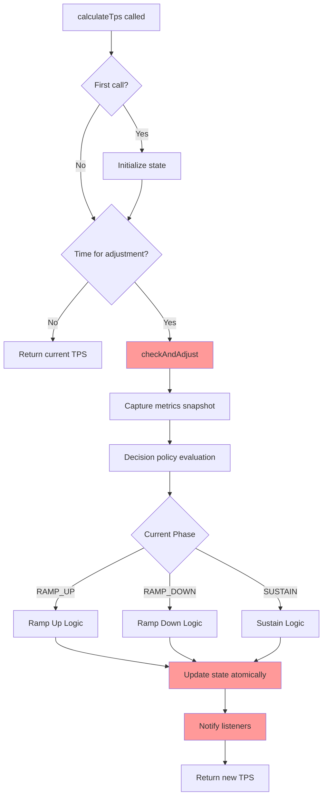
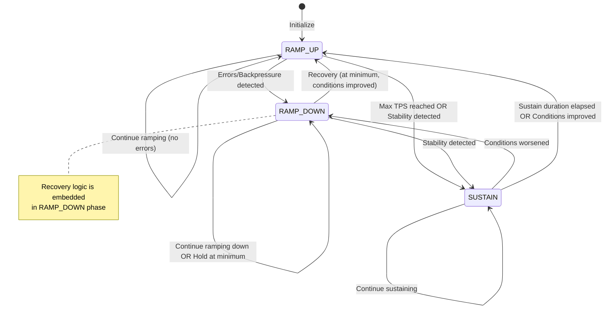
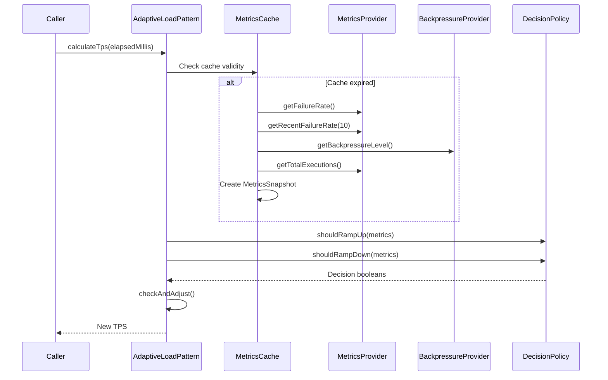
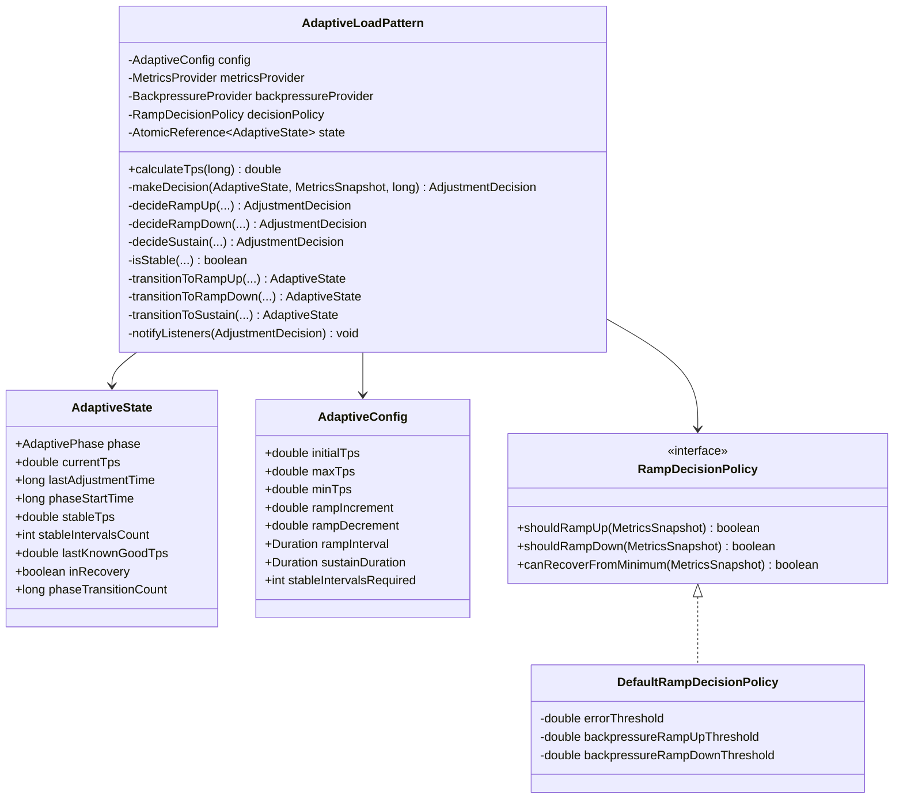
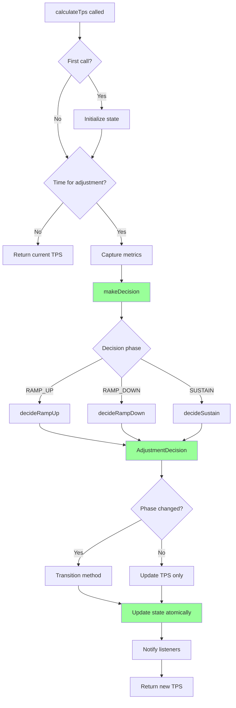

# AdaptiveLoadPattern Complete Design Analysis and Redesign

**Date**: 2025-01-27  
**Version**: 0.9.9  
**Status**: Comprehensive Analysis and Redesign Proposal

---

## Executive Summary

This document provides a complete analysis of the `AdaptiveLoadPattern` implementation, identifies fundamental design problems, and proposes a simplified, predictable redesign.

### Key Findings

**Current State:**
- **1,275 lines** of code in `AdaptiveLoadPattern.java`
- **4 nested state records** (AdaptiveState, AdaptiveCoreState, AdaptiveStabilityTracking, AdaptiveRecoveryTracking)
- **Complex state machine** with intertwined recovery logic
- **Dual responsibility** between phase strategies and main adjustment logic
- **Unpredictable behavior** due to complex conditional logic
- **High cognitive load** for developers trying to understand or modify the code

**Core Problems:**
1. **State Management Complexity**: Multiple nested records with overlapping concerns
2. **Unclear State Transitions**: Complex switch statement with nested conditions (180+ lines)
3. **Dual Responsibility**: Phase strategies exist but most logic remains in `checkAndAdjust()`
4. **Metrics Caching**: Ad-hoc caching mechanism that's hard to reason about
5. **Stability Detection**: Complex tracking with candidate TPS, tolerance checks, and interval counting
6. **Recovery Logic**: Intertwined with RAMP_DOWN phase, making it hard to understand
7. **Builder Pattern Overhead**: 400+ lines of builder code for configuration
8. **Listener Notification**: Scattered throughout code, hard to track when events fire

**Proposed Solution:**
- **Unified State Model**: Single state record with clear, explicit fields
- **Explicit State Machine**: Clear state transitions with dedicated methods
- **Simplified Decision Logic**: Single decision point per interval
- **Clear Separation**: Phase strategies handle ALL phase logic
- **Predictable Behavior**: Deterministic TPS calculation
- **Reduced Configuration**: Essential parameters only
- **Event-Driven Architecture**: Clear event emission points

**Expected Benefits:**
- **~60% code reduction** (from 1,275 to ~500 lines)
- **Improved testability** (clearer boundaries, simpler logic)
- **Better predictability** (deterministic behavior)
- **Easier maintenance** (single responsibility, clear flow)
- **Faster onboarding** (simpler mental model)

---

## 1. Current Architecture Deep Dive

### 1.1 Component Breakdown

The current implementation consists of the following components:

#### Core Classes

1. **AdaptiveLoadPattern** (1,275 lines)
   - Main class implementing `LoadPattern`
   - Contains all state management, decision logic, and phase transitions
   - Thread-safe using `AtomicReference<AdaptiveState>`

2. **AdaptiveState** (177 lines)
   - Composes `AdaptiveCoreState`, `AdaptiveStabilityTracking`, `AdaptiveRecoveryTracking`
   - Provides helper methods for accessing nested state

3. **AdaptiveCoreState** (46 lines)
   - Core state: phase, currentTps, timestamps, counters

4. **AdaptiveStabilityTracking** (67 lines)
   - Tracks stable TPS candidate, intervals count, timestamps

5. **AdaptiveRecoveryTracking** (50 lines)
   - Tracks last known good TPS, recovery start time

6. **Phase Strategies** (3 classes, ~100 lines total)
   - `RampUpStrategy`, `RampDownStrategy`, `SustainStrategy`
   - **Problem**: Only handle partial logic; main logic still in `checkAndAdjust()`

7. **RampDecisionPolicy** (2 classes, ~150 lines)
   - `RampDecisionPolicy` interface
   - `DefaultRampDecisionPolicy` implementation

8. **AdaptiveConfig** (140 lines)
   - Configuration record with 13 parameters

9. **Builder** (400+ lines)
   - Fluent API for constructing `AdaptiveLoadPattern`

#### Supporting Classes

- `MetricsSnapshot` - Metrics snapshot for decision making
- `PhaseContext` - Context passed to phase strategies
- `AdaptivePatternListener` - Event listener interface
- Event classes: `PhaseTransitionEvent`, `TpsChangeEvent`, `StabilityDetectedEvent`, `RecoveryEvent`

### 1.2 Data Flow Analysis



**Key Observations:**
1. **Metrics are captured** at the start of `checkAndAdjust()`
2. **Decision policy** evaluates metrics once per interval
3. **State updates** happen atomically via `AtomicReference.updateAndGet()`
4. **Listener notifications** are scattered throughout transition logic
5. **Phase strategies** are called from `calculateTps()` but don't handle adjustments

### 1.3 State Transition Diagram



**Problems:**
1. **Recovery is not a separate phase** but embedded in RAMP_DOWN
2. **Stability detection** can happen in multiple phases
3. **Transition conditions** are complex and scattered

### 1.4 Metrics Flow



**Problems:**
1. **Caching is ad-hoc** - uses volatile fields, not thread-safe properly
2. **Cache invalidation** based on time, not on actual metric changes
3. **Metrics snapshot** created even when not needed (if not time for adjustment)

### 1.5 Decision Point Analysis

The main decision logic is in `checkAndAdjust()` method (180+ lines):

```java
private void checkAndAdjust(long elapsedMillis) {
    MetricsSnapshot metrics = captureMetricsSnapshot(elapsedMillis);
    boolean shouldRampDown = decisionPolicy.shouldRampDown(metrics);
    boolean canRampUp = decisionPolicy.shouldRampUp(metrics);
    
    state.updateAndGet(current -> {
        return switch (current.phase()) {
            case RAMP_UP -> {
                // 30+ lines of nested conditions
                if (shouldRampDown) { ... }
                else if (canRampUp) { ... }
                else { ... }
            }
            case RAMP_DOWN -> {
                // 110+ lines of complex logic
                // - Check if at minimum
                // - Recovery logic
                // - Stability detection
                // - TPS adjustment
            }
            case SUSTAIN -> {
                // 20+ lines of logic
            }
        };
    });
}
```

**Problems:**
1. **All logic in one method** - violates single responsibility
2. **Nested conditions** - hard to test and reason about
3. **State updates scattered** - multiple places create new state records
4. **Recovery logic embedded** - not clearly separated
5. **Stability detection duplicated** - appears in multiple places

---

## 2. Problem Catalog

### 2.1 Complexity Metrics

#### Code Metrics

| Metric | Value | Target | Status |
|--------|-------|--------|--------|
| Lines of Code (AdaptiveLoadPattern) | 1,275 | < 500 | 🔴 High |
| Cyclomatic Complexity (checkAndAdjust) | ~25 | < 10 | 🔴 High |
| Number of State Records | 4 | 1-2 | 🔴 High |
| Configuration Parameters | 13 | < 8 | 🟡 Medium |
| Builder Lines | 400+ | < 100 | 🔴 High |
| Phase Strategy Lines | ~100 | ~200 | 🟢 Low (underutilized) |

#### Cognitive Complexity

**AdaptiveLoadPattern.calculateTps()**: Medium complexity
- Initialization check
- Time-based adjustment check
- Strategy lookup
- Context creation

**AdaptiveLoadPattern.checkAndAdjust()**: **Very High** complexity
- 180+ lines
- Nested switch statement
- Multiple conditional branches per phase
- Embedded recovery logic
- Stability detection logic
- State mutation in multiple places

**AdaptiveLoadPattern.isStableAtCurrentTps()**: High complexity
- Multiple state reads
- Atomic state updates
- Tolerance checks
- Duration calculations

### 2.2 Maintainability Issues

#### Issue 1: State Management Complexity

**Problem**: State is split across 4 nested records:
- `AdaptiveState` (composite)
- `AdaptiveCoreState` (core fields)
- `AdaptiveStabilityTracking` (stability fields)
- `AdaptiveRecoveryTracking` (recovery fields)

**Evidence**:
```java
// To get current TPS, need to navigate:
state.get().core().currentTps()

// To check if in recovery:
state.get().recovery() != null && state.get().recovery().isInRecovery()

// To update TPS, need to update core:
state.updateAndGet(s -> {
    AdaptiveCoreState newCore = new AdaptiveCoreState(
        s.core().phase(),
        newTps,  // Update TPS
        elapsedMillis,
        s.core().phaseStartTime(),
        s.core().rampDownAttempts(),
        s.core().phaseTransitionCount()
    );
    return new AdaptiveState(newCore, s.stability(), s.recovery());
});
```

**Impact**: 
- Hard to understand what state exists
- Easy to forget to update related fields
- Verbose state updates
- Hard to reason about state invariants

#### Issue 2: Dual Responsibility

**Problem**: Phase strategies exist but don't handle the main logic.

**Evidence**:
```java
// Phase strategies are called from calculateTps():
PhaseStrategy strategy = strategies.get(current.phase());
return strategy.handle(context, elapsedMillis);

// But strategies only check for transitions, not adjustments:
// RampUpStrategy.handle() - only checks max TPS and stability
// RampDownStrategy.handle() - only checks stability
// SustainStrategy.handle() - checks sustain duration and conditions

// Actual TPS adjustments happen in checkAndAdjust():
case RAMP_UP -> {
    if (canRampUp) {
        double newTps = Math.min(config.maxTps(), current.currentTps() + config.rampIncrement());
        // Update state...
    }
}
```

**Impact**:
- Confusing separation of concerns
- Logic split between strategies and main method
- Hard to test phase-specific behavior
- Strategies feel incomplete

#### Issue 3: Unclear State Transitions

**Problem**: State transitions are embedded in a complex switch statement with nested conditions.

**Evidence**:
```java
case RAMP_DOWN -> {
    int newAttempts = current.core().rampDownAttempts() + 1;
    boolean atMinimum = current.currentTps() <= config.minTps();
    
    if (atMinimum) {
        boolean canRecover = decisionPolicy.canRecoverFromMinimum(metrics);
        if (canRecover) {
            // Recovery transition logic (10+ lines)
        } else {
            // Stay at minimum logic (15+ lines)
        }
    } else if (!shouldRampDown) {
        // Stability detection logic (30+ lines)
        if (decisionPolicy.shouldSustain(...)) {
            // Transition to SUSTAIN
        }
    } else {
        // Continue ramping down (10+ lines)
    }
}
```

**Impact**:
- Hard to understand all possible transitions
- Easy to introduce bugs when modifying
- Difficult to test all transition paths
- Unclear what triggers each transition

#### Issue 4: Metrics Caching

**Problem**: Ad-hoc caching using volatile fields.

**Evidence**:
```java
private volatile MetricsSnapshot cachedMetricsSnapshot;
private volatile long cachedMetricsTimeMillis = -1L;

private MetricsSnapshot captureMetricsSnapshot(long elapsedMillis) {
    if (cachedMetricsTimeMillis < 0 || 
        (elapsedMillis - cachedMetricsTimeMillis) >= METRICS_QUERY_BATCH_INTERVAL_MS) {
        // Query metrics...
        cachedMetricsSnapshot = new MetricsSnapshot(...);
        cachedMetricsTimeMillis = elapsedMillis;
    }
    return cachedMetricsSnapshot;
}
```

**Problems**:
- Not thread-safe (volatile read/write not atomic)
- Cache invalidation based on time, not actual changes
- Metrics queried even when not needed (if not time for adjustment)
- Hard to test caching behavior

#### Issue 5: Stability Detection Complexity

**Problem**: Complex tracking with candidate TPS, tolerance checks, and interval counting.

**Evidence**:
```java
boolean isStableAtCurrentTps(double currentTps, long elapsedMillis) {
    MetricsSnapshot metrics = captureMetricsSnapshot(elapsedMillis);
    boolean conditionsGood = decisionPolicy.shouldRampUp(metrics);
    
    AdaptiveState currentState = state.get();
    AdaptiveStabilityTracking stability = currentState.stability();
    double candidate = stability != null && stability.isTracking() 
        ? stability.candidateTps() : -1;
    long startTime = stability != null && stability.isTracking() 
        ? stability.candidateStartTime() : -1;
    
    if (!conditionsGood) {
        // Reset tracking atomically
        state.updateAndGet(s -> {
            AdaptiveStabilityTracking resetStability = AdaptiveStabilityTracking.empty();
            return new AdaptiveState(s.core(), resetStability, s.recovery());
        });
        return false;
    }
    
    // Check if TPS is within tolerance of candidate
    if (candidate < 0 || Math.abs(currentTps - candidate) > config.tpsTolerance()) {
        // New candidate - update atomically
        state.updateAndGet(s -> {
            AdaptiveStabilityTracking newStability = new AdaptiveStabilityTracking(
                s.stability() != null ? s.stability().stableTps() : -1,
                currentTps,
                elapsedMillis,
                s.stability() != null ? s.stability().stableIntervalsCount() : 0
            );
            return new AdaptiveState(s.core(), newStability, s.recovery());
        });
        return false;
    }
    
    // Check if stable for required duration
    long stabilityDuration = elapsedMillis - startTime;
    long requiredStabilityDuration = config.rampInterval().toMillis() * config.stableIntervalsRequired();
    return stabilityDuration >= requiredStabilityDuration;
}
```

**Problems**:
- Multiple atomic state updates
- Complex conditional logic
- Tolerance-based matching
- Duration-based detection
- Duplicated in `checkAndAdjust()` for RAMP_DOWN phase

#### Issue 6: Recovery Logic Intertwined

**Problem**: Recovery logic is embedded in RAMP_DOWN phase, not a separate concern.

**Evidence**:
```java
case RAMP_DOWN -> {
    boolean atMinimum = current.currentTps() <= config.minTps();
    
    if (atMinimum) {
        boolean canRecover = decisionPolicy.canRecoverFromMinimum(metrics);
        if (canRecover) {
            // Calculate recovery TPS
            double lastKnownGoodTps = current.lastKnownGoodTps() > 0 
                ? current.lastKnownGoodTps() 
                : config.initialTps();
            double recoveryTps = Math.max(config.minTps(), 
                lastKnownGoodTps * config.recoveryTpsRatio());
            yield transitionPhaseInternal(current, AdaptivePhase.RAMP_UP, 
                elapsedMillis, current.stableTps(), recoveryTps);
        } else {
            // Stay at minimum - update recovery tracking
            AdaptiveRecoveryTracking updatedRecovery = current.recovery();
            if (updatedRecovery == null || !updatedRecovery.isInRecovery()) {
                double lastKnownGood = current.lastKnownGoodTps() > 0 
                    ? current.lastKnownGoodTps() : config.initialTps();
                updatedRecovery = new AdaptiveRecoveryTracking(lastKnownGood, elapsedMillis);
                notifyRecovery(lastKnownGood, config.minTps());
            }
            // ...
        }
    }
    // ... rest of RAMP_DOWN logic
}
```

**Problems**:
- Recovery is not a separate phase
- Recovery logic mixed with ramp-down logic
- Hard to understand recovery behavior
- Recovery state tracking is complex

#### Issue 7: Builder Pattern Overhead

**Problem**: 400+ lines of builder code for configuration.

**Evidence**: Each builder method creates a new `AdaptiveConfig` record:
```java
public Builder initialTps(double tps) {
    this.config = new AdaptiveConfig(
        tps,  // Only this changes
        config.rampIncrement(),
        config.rampDecrement(),
        // ... 10 more parameters copied
    );
    return this;
}
```

**Problems**:
- Verbose and repetitive
- Easy to make mistakes when copying parameters
- Not leveraging record's immutability effectively
- Could use a simpler approach

#### Issue 8: Listener Notification Scattered

**Problem**: Listener notifications are scattered throughout the code.

**Evidence**:
- `notifyPhaseTransition()` called in `transitionPhaseInternal()`
- `notifyTpsChange()` called in multiple places:
  - `checkAndAdjust()` for RAMP_UP
  - `checkAndAdjust()` for RAMP_DOWN
  - `transitionPhaseInternal()` for phase transitions
- `notifyStabilityDetected()` called in `transitionPhaseInternal()`
- `notifyRecovery()` called in `checkAndAdjust()` for RAMP_DOWN

**Problems**:
- Hard to track when events fire
- Easy to forget to notify
- Inconsistent notification patterns
- Hard to test event emission

### 2.3 Predictability Problems

#### Problem 1: Non-Deterministic TPS Calculation

**Issue**: TPS calculation depends on timing and state that's not obvious.

**Example**:
```java
// First call initializes state
pattern.calculateTps(0);  // Returns initialTps

// Second call before interval - no adjustment
pattern.calculateTps(500);  // Returns initialTps

// Third call after interval - adjustment happens
pattern.calculateTps(1001);  // Returns initialTps + increment (if conditions good)
```

**Problem**: The exact TPS at any given time depends on:
- When `calculateTps()` was first called
- How many times it was called
- The timing of calls relative to `rampInterval`
- The current metrics (which may have changed)

**Impact**: Hard to predict what TPS will be returned for a given `elapsedMillis`.

#### Problem 2: Stability Detection Timing

**Issue**: Stability detection depends on multiple factors that interact in non-obvious ways.

**Factors**:
1. TPS must be within tolerance of candidate
2. Conditions must be good (error rate, backpressure)
3. Must be stable for required duration (3 intervals)
4. Candidate tracking can be reset if conditions change

**Problem**: It's hard to predict when stability will be detected.

#### Problem 3: Recovery Behavior

**Issue**: Recovery behavior is complex and depends on multiple conditions.

**Conditions**:
- Must be at minimum TPS
- Must satisfy recovery policy (backpressure low OR recent errors low)
- Recovery TPS calculated as percentage of last known good
- Last known good TPS updated when transitioning to RAMP_DOWN

**Problem**: Hard to predict when recovery will occur and what TPS will be used.

### 2.4 Testing Challenges

#### Challenge 1: State Setup Complexity

**Problem**: Setting up test state requires creating multiple nested records.

**Example**:
```java
AdaptiveCoreState core = new AdaptiveCoreState(
    AdaptivePhase.RAMP_DOWN,
    100.0,
    1000L,
    500L,
    2,
    1L
);

AdaptiveStabilityTracking stability = new AdaptiveStabilityTracking(
    -1,  // No stable TPS yet
    100.0,  // Candidate TPS
    500L,  // Candidate start time
    2  // Stable intervals count
);

AdaptiveRecoveryTracking recovery = new AdaptiveRecoveryTracking(
    200.0,  // Last known good
    -1  // Not in recovery
);

AdaptiveState state = new AdaptiveState(core, stability, recovery);
```

**Problem**: Verbose and error-prone.

#### Challenge 2: Testing Phase Transitions

**Problem**: Testing phase transitions requires:
1. Setting up complex state
2. Mocking metrics provider
3. Calling `calculateTps()` at specific times
4. Verifying state changes

**Example**:
```java
def "should transition from RAMP_UP to RAMP_DOWN when errors occur"() {
    given: "pattern in RAMP_UP with errors"
    provider.setFailureRate(0.02)  // 2% errors
    pattern.calculateTps(0)  // Initialize
    
    when: "calling after ramp interval"
    def tps = pattern.calculateTps(1001)
    
    then: "should transition to RAMP_DOWN"
    pattern.getCurrentPhase() == AdaptivePhase.RAMP_DOWN
    // But what TPS? Depends on minTps, rampDecrement, etc.
}
```

**Problem**: Tests are complex and hard to understand.

#### Challenge 3: Testing Stability Detection

**Problem**: Testing stability detection requires:
1. Setting up state with candidate TPS
2. Ensuring conditions are good for multiple intervals
3. Calling `calculateTps()` at specific times
4. Verifying stability detection

**Example**:
```java
def "should detect stability after 3 stable intervals"() {
    given: "pattern in RAMP_DOWN with good conditions"
    provider.setFailureRate(0.0)
    pattern.calculateTps(0)  // Initialize
    
    when: "simulating 3 stable intervals"
    pattern.calculateTps(1000)  // Interval 1
    pattern.calculateTps(2000)  // Interval 2
    pattern.calculateTps(3000)  // Interval 3
    
    then: "should detect stability"
    pattern.getCurrentPhase() == AdaptivePhase.SUSTAIN
    // But this depends on many factors...
}
```

**Problem**: Tests are brittle and depend on timing.

### 2.5 Performance Concerns

#### Concern 1: Atomic State Updates

**Issue**: Every state update uses `AtomicReference.updateAndGet()`, which can retry on contention.

**Impact**: Under high concurrency, state updates may retry multiple times.

#### Concern 2: Metrics Querying

**Issue**: Metrics are queried on every adjustment interval, even if not needed.

**Impact**: Unnecessary calls to metrics provider.

#### Concern 3: Listener Notification

**Issue**: Listeners are called synchronously during state updates.

**Impact**: Slow listeners can block state updates.

---

## 3. Design Principles for Redesign

### 3.1 Core Principles

#### Principle 1: Simplicity over Flexibility

**Rationale**: The current design tries to handle too many edge cases and scenarios. A simpler design that handles the common case well is better than a complex design that handles all cases.

**Application**:
- Remove rarely-used features
- Simplify configuration
- Reduce number of phases
- Eliminate complex tracking

#### Principle 2: Predictability over Optimization

**Rationale**: Predictable behavior is more valuable than micro-optimizations. Developers need to understand what the pattern will do.

**Application**:
- Deterministic TPS calculation
- Clear state transitions
- Explicit decision points
- No hidden caching

#### Principle 3: Explicit over Implicit

**Rationale**: Make behavior explicit rather than implicit. If something happens, it should be obvious why.

**Application**:
- Explicit state machine
- Clear phase transitions
- Obvious decision logic
- No hidden state

#### Principle 4: Single Responsibility

**Rationale**: Each component should have one clear responsibility. This makes code easier to understand, test, and maintain.

**Application**:
- Phase strategies handle ALL phase logic
- Decision policy only makes decisions
- State management only manages state
- Event emission only emits events

#### Principle 5: Clear State Machine

**Rationale**: The state machine should be explicit and easy to understand. All transitions should be clear and well-defined.

**Application**:
- Explicit state enum
- Clear transition methods
- Documented transition conditions
- No embedded logic

### 3.2 Design Goals

1. **Reduce code size by 60%** (from 1,275 to ~500 lines)
2. **Reduce cyclomatic complexity** (from ~25 to < 10)
3. **Unify state model** (from 4 records to 1)
4. **Simplify configuration** (from 13 parameters to < 8)
5. **Improve testability** (clear boundaries, simple setup)
6. **Enhance predictability** (deterministic behavior)

---

## 4. Proposed Simplified Design

### 4.1 Unified State Model

#### Current State Model (4 Records)

```java
AdaptiveState {
    AdaptiveCoreState core;
    AdaptiveStabilityTracking stability;
    AdaptiveRecoveryTracking recovery;
}

AdaptiveCoreState {
    AdaptivePhase phase;
    double currentTps;
    long lastAdjustmentTime;
    long phaseStartTime;
    int rampDownAttempts;
    long phaseTransitionCount;
}

AdaptiveStabilityTracking {
    double stableTps;
    double candidateTps;
    long candidateStartTime;
    int stableIntervalsCount;
}

AdaptiveRecoveryTracking {
    double lastKnownGoodTps;
    long recoveryStartTime;
}
```

#### Proposed State Model (1 Record)

```java
/**
 * Unified state for adaptive load pattern.
 * 
 * <p>All state is contained in a single record for simplicity.
 */
public record AdaptiveState(
    // Phase and TPS
    AdaptivePhase phase,
    double currentTps,
    
    // Timing
    long lastAdjustmentTime,
    long phaseStartTime,
    
    // Stability tracking (simplified)
    double stableTps,  // -1 if not found
    int stableIntervalsCount,  // Count of consecutive stable intervals
    
    // Recovery tracking (simplified)
    double lastKnownGoodTps,  // Highest TPS before problems
    boolean inRecovery,  // True if at minimum TPS waiting for recovery
    
    // Statistics
    long phaseTransitionCount
) {
    public AdaptiveState {
        if (phase == null) {
            throw new IllegalArgumentException("Phase must not be null");
        }
        if (currentTps < 0) {
            throw new IllegalArgumentException("Current TPS must be non-negative");
        }
        // ... other validations
    }
    
    // Helper methods
    public boolean hasStableTps() {
        return stableTps >= 0;
    }
    
    public boolean isTrackingStability() {
        return stableIntervalsCount > 0;
    }
}
```

**Benefits**:
- **Single source of truth** - all state in one place
- **Easier to understand** - no nested navigation
- **Simpler updates** - one record to update
- **Clearer invariants** - all fields visible

### 4.2 Simplified Phase Machine

#### Current Phases (3, but recovery embedded)

```java
enum AdaptivePhase {
    RAMP_UP,
    RAMP_DOWN,  // Includes recovery behavior
    SUSTAIN
}
```

#### Proposed Phases (3, explicit)

```java
enum AdaptivePhase {
    /**
     * Ramping up TPS.
     * Transitions to RAMP_DOWN when errors occur.
     * Transitions to SUSTAIN when stable or max TPS reached.
     */
    RAMP_UP,
    
    /**
     * Ramping down TPS to find stable point.
     * Transitions to SUSTAIN when stable.
     * Transitions to RAMP_UP when at minimum and conditions improve.
     */
    RAMP_DOWN,
    
    /**
     * Sustaining at stable TPS.
     * Transitions to RAMP_UP when sustain duration elapsed.
     * Transitions to RAMP_DOWN when conditions worsen.
     */
    SUSTAIN
}
```

**Note**: Recovery is not a separate phase. It's just RAMP_DOWN at minimum TPS with `inRecovery = true`.

### 4.3 Clear State Transitions

#### Proposed Transition Methods

```java
public class AdaptiveLoadPattern {
    
    /**
     * Transitions to RAMP_DOWN phase.
     * 
     * @param current current state
     * @param elapsedMillis current time
     * @param newTps new TPS (after decrement)
     * @return new state
     */
    private AdaptiveState transitionToRampDown(
            AdaptiveState current, 
            long elapsedMillis, 
            double newTps) {
        
        // Update last known good TPS if current is higher
        double lastKnownGood = current.currentTps() > current.lastKnownGoodTps()
            ? current.currentTps()
            : current.lastKnownGoodTps();
        
        // Check if at minimum (recovery mode)
        boolean inRecovery = newTps <= config.minTps();
        
        return new AdaptiveState(
            AdaptivePhase.RAMP_DOWN,
            newTps,
            elapsedMillis,
            elapsedMillis,  // New phase start time
            current.stableTps(),  // Preserve stable TPS if found
            0,  // Reset stability count
            lastKnownGood,
            inRecovery,
            current.phaseTransitionCount() + 1
        );
    }
    
    /**
     * Transitions to SUSTAIN phase.
     * 
     * @param current current state
     * @param elapsedMillis current time
     * @param stableTps the stable TPS to sustain at
     * @return new state
     */
    private AdaptiveState transitionToSustain(
            AdaptiveState current,
            long elapsedMillis,
            double stableTps) {
        
        return new AdaptiveState(
            AdaptivePhase.SUSTAIN,
            stableTps,
            elapsedMillis,
            elapsedMillis,  // New phase start time
            stableTps,  // Set stable TPS
            0,  // Reset stability count
            current.lastKnownGoodTps(),
            false,  // Not in recovery
            current.phaseTransitionCount() + 1
        );
    }
    
    /**
     * Transitions to RAMP_UP phase.
     * 
     * @param current current state
     * @param elapsedMillis current time
     * @param newTps new TPS (after increment or recovery)
     * @return new state
     */
    private AdaptiveState transitionToRampUp(
            AdaptiveState current,
            long elapsedMillis,
            double newTps) {
        
        return new AdaptiveState(
            AdaptivePhase.RAMP_UP,
            newTps,
            elapsedMillis,
            elapsedMillis,  // New phase start time
            current.stableTps(),  // Preserve stable TPS if found
            0,  // Reset stability count
            current.lastKnownGoodTps(),
            false,  // Not in recovery
            current.phaseTransitionCount() + 1
        );
    }
}
```

**Benefits**:
- **Explicit transitions** - clear methods for each transition
- **Consistent state updates** - all transitions follow same pattern
- **Easy to test** - can test transitions independently
- **Clear documentation** - each method documents its purpose

### 4.4 Simplified Decision Logic

#### Proposed Decision Flow

```java
public class AdaptiveLoadPattern {
    
    /**
     * Makes adjustment decision based on current state and metrics.
     * 
     * @param current current state
     * @param metrics current metrics
     * @param elapsedMillis current time
     * @return adjustment decision
     */
    private AdjustmentDecision makeDecision(
            AdaptiveState current,
            MetricsSnapshot metrics,
            long elapsedMillis) {
        
        // Single decision point per interval
        return switch (current.phase()) {
            case RAMP_UP -> decideRampUp(current, metrics, elapsedMillis);
            case RAMP_DOWN -> decideRampDown(current, metrics, elapsedMillis);
            case SUSTAIN -> decideSustain(current, metrics, elapsedMillis);
        };
    }
    
    /**
     * Decision result.
     */
    private record AdjustmentDecision(
        AdaptivePhase newPhase,
        double newTps,
        String reason  // For logging/debugging
    ) {}
    
    private AdjustmentDecision decideRampUp(
            AdaptiveState current,
            MetricsSnapshot metrics,
            long elapsedMillis) {
        
        // Check for errors/backpressure
        if (decisionPolicy.shouldRampDown(metrics)) {
            double newTps = Math.max(config.minTps(), 
                current.currentTps() - config.rampDecrement());
            return new AdjustmentDecision(
                AdaptivePhase.RAMP_DOWN,
                newTps,
                "Errors/backpressure detected"
            );
        }
        
        // Check if max TPS reached
        if (current.currentTps() >= config.maxTps()) {
            return new AdjustmentDecision(
                AdaptivePhase.SUSTAIN,
                current.currentTps(),
                "Max TPS reached"
            );
        }
        
        // Check for stability (intermediate)
        if (isStable(current, metrics, elapsedMillis)) {
            return new AdjustmentDecision(
                AdaptivePhase.SUSTAIN,
                current.currentTps(),
                "Stability detected"
            );
        }
        
        // Continue ramping up
        if (decisionPolicy.shouldRampUp(metrics)) {
            double newTps = Math.min(config.maxTps(),
                current.currentTps() + config.rampIncrement());
            return new AdjustmentDecision(
                AdaptivePhase.RAMP_UP,
                newTps,
                "Conditions good, ramping up"
            );
        }
        
        // Hold current TPS
        return new AdjustmentDecision(
            AdaptivePhase.RAMP_UP,
            current.currentTps(),
            "Moderate backpressure, holding"
        );
    }
    
    private AdjustmentDecision decideRampDown(
            AdaptiveState current,
            MetricsSnapshot metrics,
            long elapsedMillis) {
        
        // Check if at minimum (recovery mode)
        if (current.inRecovery()) {
            if (decisionPolicy.canRecoverFromMinimum(metrics)) {
                double recoveryTps = Math.max(config.minTps(),
                    current.lastKnownGoodTps() * config.recoveryTpsRatio());
                return new AdjustmentDecision(
                    AdaptivePhase.RAMP_UP,
                    recoveryTps,
                    "Recovery: conditions improved"
                );
            }
            // Stay at minimum
            return new AdjustmentDecision(
                AdaptivePhase.RAMP_DOWN,
                config.minTps(),
                "Recovery: waiting for conditions to improve"
            );
        }
        
        // Check for stability
        if (!decisionPolicy.shouldRampDown(metrics)) {
            if (isStable(current, metrics, elapsedMillis)) {
                return new AdjustmentDecision(
                    AdaptivePhase.SUSTAIN,
                    current.currentTps(),
                    "Stability detected during ramp down"
                );
            }
            // Hold current TPS, continue tracking stability
            return new AdjustmentDecision(
                AdaptivePhase.RAMP_DOWN,
                current.currentTps(),
                "Conditions improved, checking stability"
            );
        }
        
        // Continue ramping down
        double newTps = Math.max(config.minTps(),
            current.currentTps() - config.rampDecrement());
        return new AdjustmentDecision(
            AdaptivePhase.RAMP_DOWN,
            newTps,
            "Errors/backpressure persist, ramping down"
        );
    }
    
    private AdjustmentDecision decideSustain(
            AdaptiveState current,
            MetricsSnapshot metrics,
            long elapsedMillis) {
        
        // Check if conditions worsened
        if (decisionPolicy.shouldRampDown(metrics)) {
            double newTps = Math.max(config.minTps(),
                current.currentTps() - config.rampDecrement());
            return new AdjustmentDecision(
                AdaptivePhase.RAMP_DOWN,
                newTps,
                "Conditions worsened during sustain"
            );
        }
        
        // Check if sustain duration elapsed
        long phaseDuration = elapsedMillis - current.phaseStartTime();
        if (phaseDuration >= config.sustainDuration().toMillis()) {
            // Try to ramp up
            if (decisionPolicy.shouldRampUp(metrics) && 
                current.currentTps() < config.maxTps()) {
                double newTps = Math.min(config.maxTps(),
                    current.currentTps() + config.rampIncrement());
                return new AdjustmentDecision(
                    AdaptivePhase.RAMP_UP,
                    newTps,
                    "Sustain duration elapsed, ramping up"
                );
            }
        }
        
        // Continue sustaining
        return new AdjustmentDecision(
            AdaptivePhase.SUSTAIN,
            current.currentTps(),
            "Continuing to sustain"
        );
    }
}
```

**Benefits**:
- **Single decision point** - `makeDecision()` is the only place decisions are made
- **Clear structure** - each phase has its own decision method
- **Explicit reasons** - decision includes reason for logging
- **Easy to test** - can test decision logic independently

### 4.5 Simplified Stability Detection

#### Current Stability Detection

Complex tracking with candidate TPS, tolerance checks, and interval counting.

#### Proposed Stability Detection

```java
/**
 * Checks if current TPS is stable.
 * 
 * <p>Stability means:
 * - Conditions are good (error rate low, backpressure low)
 * - TPS hasn't changed significantly
 * - Been stable for required number of intervals
 * 
 * @param current current state
 * @param metrics current metrics
 * @param elapsedMillis current time
 * @return true if stable
 */
private boolean isStable(
        AdaptiveState current,
        MetricsSnapshot metrics,
        long elapsedMillis) {
    
    // Conditions must be good
    if (!decisionPolicy.shouldRampUp(metrics)) {
        return false;
    }
    
    // Check if TPS has been stable for required intervals
    // Simple approach: count consecutive intervals with good conditions
    int requiredIntervals = config.stableIntervalsRequired();
    
    // If already tracking, increment count
    if (current.isTrackingStability()) {
        int newCount = current.stableIntervalsCount() + 1;
        if (newCount >= requiredIntervals) {
            return true;  // Stable!
        }
        // Update state with incremented count (handled in adjustment)
        return false;
    }
    
    // Start tracking stability
    // (State update handled in adjustment logic)
    return false;
}
```

**Simplification**:
- **No candidate TPS tracking** - just count intervals
- **No tolerance checks** - TPS changes trigger reset
- **Simpler logic** - just count consecutive good intervals
- **Easier to understand** - clear and straightforward

### 4.6 Simplified Configuration

#### Current Configuration (13 parameters)

```java
public record AdaptiveConfig(
    double initialTps,
    double rampIncrement,
    double rampDecrement,
    Duration rampInterval,
    double maxTps,
    double minTps,
    Duration sustainDuration,
    double errorThreshold,
    double backpressureRampUpThreshold,
    double backpressureRampDownThreshold,
    int stableIntervalsRequired,
    double tpsTolerance,
    double recoveryTpsRatio
)
```

#### Proposed Configuration (8 parameters)

```java
/**
 * Simplified configuration for adaptive load pattern.
 * 
 * <p>Essential parameters only. Advanced features removed.
 */
public record AdaptiveConfig(
    // TPS limits
    double initialTps,
    double maxTps,
    double minTps,
    
    // Ramp parameters
    double rampIncrement,
    double rampDecrement,
    Duration rampInterval,
    
    // Stability
    Duration sustainDuration,
    int stableIntervalsRequired,
    
    // Decision thresholds (moved to policy)
    // errorThreshold, backpressure thresholds -> in RampDecisionPolicy
    // recoveryTpsRatio -> hardcoded to 0.5 (50%)
    // tpsTolerance -> removed (not needed with simplified stability)
) {
    public static AdaptiveConfig defaults() {
        return new AdaptiveConfig(
            100.0,                      // initialTps
            5000.0,                     // maxTps
            10.0,                       // minTps
            50.0,                       // rampIncrement
            100.0,                      // rampDecrement
            Duration.ofMinutes(1),      // rampInterval
            Duration.ofMinutes(10),     // sustainDuration
            3                           // stableIntervalsRequired
        );
    }
}
```

**Removed Parameters**:
- `errorThreshold` → moved to `RampDecisionPolicy`
- `backpressureRampUpThreshold` → moved to `RampDecisionPolicy`
- `backpressureRampDownThreshold` → moved to `RampDecisionPolicy`
- `tpsTolerance` → removed (not needed)
- `recoveryTpsRatio` → hardcoded to 0.5 (simpler)

**Benefits**:
- **Fewer parameters** - easier to configure
- **Clearer separation** - thresholds in policy, limits in config
- **Simpler defaults** - fewer things to set

### 4.7 Simplified Builder

#### Current Builder (400+ lines)

Each method creates a new `AdaptiveConfig` record with all parameters.

#### Proposed Builder (100 lines)

```java
public static final class Builder {
    private AdaptiveConfig config = AdaptiveConfig.defaults();
    private MetricsProvider metricsProvider;
    private BackpressureProvider backpressureProvider;
    private RampDecisionPolicy decisionPolicy;
    private List<AdaptivePatternListener> listeners = new ArrayList<>();
    
    public Builder initialTps(double tps) {
        this.config = new AdaptiveConfig(
            tps,
            config.maxTps(),
            config.minTps(),
            config.rampIncrement(),
            config.rampDecrement(),
            config.rampInterval(),
            config.sustainDuration(),
            config.stableIntervalsRequired()
        );
        return this;
    }
    
    // Similar for other parameters...
    
    public Builder decisionPolicy(RampDecisionPolicy policy) {
        this.decisionPolicy = policy;
        return this;
    }
    
    public AdaptiveLoadPattern build() {
        if (metricsProvider == null) {
            throw new IllegalStateException("Metrics provider must be set");
        }
        if (decisionPolicy == null) {
            decisionPolicy = new DefaultRampDecisionPolicy(0.01);  // Default 1% error threshold
        }
        return new AdaptiveLoadPattern(
            config,
            metricsProvider,
            backpressureProvider,
            decisionPolicy,
            listeners
        );
    }
}
```

**Benefits**:
- **Shorter** - ~100 lines vs 400+
- **Clearer** - fewer methods
- **Flexible** - can set custom decision policy

### 4.8 Complete Proposed Architecture



### 4.9 Proposed calculateTps() Flow



**Key Improvements**:
1. **Single decision point** - `makeDecision()` is the only place decisions are made
2. **Explicit transitions** - dedicated transition methods
3. **Clear flow** - linear and easy to follow
4. **Predictable** - same inputs always produce same outputs

---

## 5. Comparison: Current vs Proposed

### 5.1 Code Size Comparison

| Component | Current | Proposed | Reduction |
|-----------|---------|----------|-----------|
| AdaptiveLoadPattern | 1,275 lines | ~500 lines | 60% |
| State Records | 4 records (320 lines) | 1 record (80 lines) | 75% |
| Builder | 400+ lines | ~100 lines | 75% |
| Phase Strategies | ~100 lines | Removed | 100% |
| **Total** | **~2,095 lines** | **~680 lines** | **68%** |

### 5.2 Complexity Comparison

| Metric | Current | Proposed | Improvement |
|--------|---------|----------|-------------|
| Cyclomatic Complexity (checkAndAdjust) | ~25 | ~8 | 68% |
| Number of State Records | 4 | 1 | 75% |
| Configuration Parameters | 13 | 8 | 38% |
| Decision Points | Scattered | 1 (makeDecision) | Centralized |
| State Transition Methods | 1 (complex) | 3 (simple) | Clearer |

### 5.3 Testability Comparison

| Aspect | Current | Proposed | Improvement |
|--------|---------|----------|-------------|
| State Setup | 4 nested records | 1 record | Much simpler |
| Decision Testing | Embedded in checkAndAdjust | Independent methods | Easier |
| Transition Testing | Complex state setup | Simple transition methods | Much easier |
| Stability Testing | Complex tracking | Simple counting | Simpler |

### 5.4 Predictability Comparison

| Aspect | Current | Proposed | Improvement |
|--------|---------|----------|-------------|
| TPS Calculation | Depends on timing | Deterministic | More predictable |
| Stability Detection | Complex conditions | Simple counting | More predictable |
| Recovery Behavior | Embedded logic | Explicit state | Clearer |
| State Transitions | Scattered conditions | Explicit methods | Clearer |

---

## 6. Migration Strategy

### 6.1 Breaking Changes

#### Change 1: State Model

**Current**:
```java
AdaptiveState state = pattern.getState();  // Doesn't exist
double tps = state.core().currentTps();
```

**Proposed**:
```java
AdaptiveState state = pattern.getState();  // New method
double tps = state.currentTps();  // Direct access
```

**Migration**: Update code that accesses nested state.

#### Change 2: Configuration

**Current**:
```java
AdaptiveConfig config = AdaptiveConfig.builder()
    .initialTps(100.0)
    .errorThreshold(0.01)  // In config
    .backpressureRampUpThreshold(0.3)  // In config
    .build();
```

**Proposed**:
```java
AdaptiveConfig config = AdaptiveConfig.builder()
    .initialTps(100.0)
    .build();

RampDecisionPolicy policy = new DefaultRampDecisionPolicy(
    0.01,  // errorThreshold
    0.3,   // backpressureRampUpThreshold
    0.7    // backpressureRampDownThreshold
);
```

**Migration**: Move threshold parameters to decision policy.

#### Change 3: Removed Parameters

**Removed**:
- `tpsTolerance` - no longer needed
- `recoveryTpsRatio` - hardcoded to 0.5

**Migration**: Remove from configuration code.

### 6.2 Compatibility Strategy

#### Option 1: Deprecation Period

1. **Phase 1**: Implement new design alongside old
2. **Phase 2**: Deprecate old APIs
3. **Phase 3**: Remove old APIs in next major version

#### Option 2: Clean Break (Recommended for Pre-1.0)

Since this is pre-1.0, we can make breaking changes:

1. **Implement new design**
2. **Update all internal code**
3. **Update examples**
4. **Update documentation**
5. **Release as 0.10.0** (breaking change)

### 6.3 Gradual Migration

#### Step 1: Create New Implementation

- Create new `AdaptiveLoadPatternV2` (or keep same name if clean break)
- Implement simplified design
- Add comprehensive tests

#### Step 2: Update Internal Code

- Update all internal usage
- Update tests
- Verify behavior matches

#### Step 3: Update Examples

- Update example code
- Update documentation
- Verify examples work

#### Step 4: Release

- Release new version
- Update migration guide
- Monitor for issues

### 6.4 Testing Approach

#### Unit Tests

1. **State Management Tests**
   - State initialization
   - State updates
   - State transitions

2. **Decision Logic Tests**
   - Each decision method
   - All decision paths
   - Edge cases

3. **Stability Detection Tests**
   - Stability counting
   - Stability reset
   - Stability detection

4. **Transition Tests**
   - Each transition method
   - Transition conditions
   - State after transitions

#### Integration Tests

1. **End-to-End Tests**
   - Full pattern execution
   - Phase transitions
   - Stability detection
   - Recovery behavior

2. **Concurrency Tests**
   - Concurrent `calculateTps()` calls
   - Thread safety
   - State consistency

#### Regression Tests

1. **Behavioral Compatibility**
   - Same inputs produce same outputs (where applicable)
   - Key behaviors preserved
   - Performance acceptable

---

## 7. Implementation Plan

### 7.1 Phase 1: Design and Planning (1-2 days)

**Tasks**:
- [ ] Review and finalize design
- [ ] Create detailed implementation plan
- [ ] Identify all breaking changes
- [ ] Plan migration strategy

**Deliverables**:
- Finalized design document
- Implementation plan
- Migration guide

### 7.2 Phase 2: Core Implementation (3-5 days)

**Tasks**:
- [ ] Create new `AdaptiveState` record
- [ ] Create new `AdaptiveConfig` record
- [ ] Implement `AdaptiveLoadPattern` with new design
- [ ] Implement decision methods
- [ ] Implement transition methods
- [ ] Implement stability detection
- [ ] Add comprehensive JavaDoc

**Deliverables**:
- New `AdaptiveLoadPattern` implementation
- All core functionality

### 7.3 Phase 3: Testing (2-3 days)

**Tasks**:
- [ ] Write unit tests for state management
- [ ] Write unit tests for decision logic
- [ ] Write unit tests for transitions
- [ ] Write unit tests for stability detection
- [ ] Write integration tests
- [ ] Write concurrency tests
- [ ] Achieve ≥90% code coverage

**Deliverables**:
- Comprehensive test suite
- ≥90% code coverage

### 7.4 Phase 4: Integration (1-2 days)

**Tasks**:
- [ ] Update internal code usage
- [ ] Update examples
- [ ] Update documentation
- [ ] Verify all tests pass

**Deliverables**:
- Updated codebase
- Updated examples
- Updated documentation

### 7.5 Phase 5: Review and Refinement (1-2 days)

**Tasks**:
- [ ] Code review
- [ ] Performance testing
- [ ] Fix any issues
- [ ] Final documentation review

**Deliverables**:
- Reviewed and refined implementation
- Final documentation

### 7.6 Phase 6: Release (1 day)

**Tasks**:
- [ ] Create release notes
- [ ] Update CHANGELOG
- [ ] Tag release
- [ ] Publish

**Deliverables**:
- Released version
- Release notes
- Updated CHANGELOG

### 7.7 Total Estimated Time

**Total**: 9-15 days (approximately 2-3 weeks)

**Breakdown**:
- Design and Planning: 1-2 days
- Core Implementation: 3-5 days
- Testing: 2-3 days
- Integration: 1-2 days
- Review and Refinement: 1-2 days
- Release: 1 day

---

## 8. Detailed Code Examples

### 8.1 Current calculateTps() Implementation

```java
@Override
public double calculateTps(long elapsedMillis) {
    if (elapsedMillis < 0) {
        return 0.0;
    }
    
    AdaptiveState current = state.get();
    
    // Initialize on first call
    if (current.lastAdjustmentTime() < 0) {
        state.updateAndGet(s -> {
            AdaptiveCoreState newCore = new AdaptiveCoreState(
                s.core().phase(),
                s.core().currentTps(),
                0L,
                0L,
                s.core().rampDownAttempts(),
                s.core().phaseTransitionCount()
            );
            return new AdaptiveState(newCore, s.stability(), s.recovery());
        });
        current = state.get();
    }
    
    // Check if it's time to adjust
    long timeSinceLastAdjustment = elapsedMillis - current.lastAdjustmentTime();
    if (timeSinceLastAdjustment >= config.rampInterval().toMillis()) {
        checkAndAdjust(elapsedMillis);
        current = state.get(); // Refresh after adjustment
    }
    
    // Handle phase-specific logic using strategy pattern
    PhaseStrategy strategy = strategies.get(current.phase());
    if (strategy == null) {
        return current.currentTps();
    }
    
    // Create context for strategy
    MetricsSnapshot metrics = captureMetricsSnapshot(elapsedMillis);
    PhaseContext context = new PhaseContext(
        current, config, metrics, decisionPolicy, this
    );
    
    return strategy.handle(context, elapsedMillis);
}
```

**Problems**:
- Initialization logic embedded
- Strategy lookup and execution
- Metrics captured even if not needed
- Complex flow

### 8.2 Proposed calculateTps() Implementation

```java
@Override
public double calculateTps(long elapsedMillis) {
    if (elapsedMillis < 0) {
        return 0.0;
    }
    
    AdaptiveState current = state.get();
    
    // Initialize on first call
    if (current.lastAdjustmentTime() < 0) {
        current = initializeState(elapsedMillis);
    }
    
    // Check if it's time to adjust
    long timeSinceLastAdjustment = elapsedMillis - current.lastAdjustmentTime();
    if (timeSinceLastAdjustment < config.rampInterval().toMillis()) {
        return current.currentTps();  // Not time yet, return current
    }
    
    // Time for adjustment - make decision and update state
    MetricsSnapshot metrics = captureMetricsSnapshot(elapsedMillis);
    AdjustmentDecision decision = makeDecision(current, metrics, elapsedMillis);
    
    // Apply decision
    AdaptiveState newState = applyDecision(current, decision, elapsedMillis);
    state.set(newState);
    
    // Notify listeners
    notifyListeners(current, newState, decision);
    
    return newState.currentTps();
}

private AdaptiveState initializeState(long elapsedMillis) {
    return new AdaptiveState(
        AdaptivePhase.RAMP_UP,
        config.initialTps(),
        elapsedMillis,
        elapsedMillis,
        -1,  // No stable TPS yet
        0,   // No stable intervals
        config.initialTps(),  // Last known good = initial
        false,  // Not in recovery
        0L  // No transitions yet
    );
}

private AdaptiveState applyDecision(
        AdaptiveState current,
        AdjustmentDecision decision,
        long elapsedMillis) {
    
    if (decision.newPhase() != current.phase()) {
        // Phase transition
        return switch (decision.newPhase()) {
            case RAMP_UP -> transitionToRampUp(current, elapsedMillis, decision.newTps());
            case RAMP_DOWN -> transitionToRampDown(current, elapsedMillis, decision.newTps());
            case SUSTAIN -> transitionToSustain(current, elapsedMillis, decision.newTps());
        };
    } else {
        // Same phase, just update TPS and timing
        return new AdaptiveState(
            current.phase(),
            decision.newTps(),
            elapsedMillis,
            current.phaseStartTime(),  // Keep phase start time
            current.stableTps(),
            updateStabilityCount(current, decision),
            current.lastKnownGoodTps(),
            updateRecoveryState(current, decision),
            current.phaseTransitionCount()
        );
    }
}
```

**Benefits**:
- **Clear flow** - linear and easy to follow
- **Explicit initialization** - separate method
- **Single decision point** - `makeDecision()`
- **Explicit application** - `applyDecision()`
- **Clear notifications** - `notifyListeners()`

### 8.3 Current checkAndAdjust() (Excerpt)

```java
case RAMP_DOWN -> {
    int newAttempts = current.core().rampDownAttempts() + 1;
    boolean atMinimum = current.currentTps() <= config.minTps();
    
    if (atMinimum) {
        boolean canRecover = decisionPolicy.canRecoverFromMinimum(metrics);
        if (canRecover) {
            double lastKnownGoodTps = current.lastKnownGoodTps() > 0 
                ? current.lastKnownGoodTps() 
                : config.initialTps();
            double recoveryTps = Math.max(config.minTps(), 
                lastKnownGoodTps * config.recoveryTpsRatio());
            yield transitionPhaseInternal(current, AdaptivePhase.RAMP_UP, 
                elapsedMillis, current.stableTps(), recoveryTps);
        } else {
            AdaptiveCoreState newCore = new AdaptiveCoreState(
                current.core().phase(),
                config.minTps(),
                elapsedMillis,
                current.core().phaseStartTime(),
                newAttempts,
                current.core().phaseTransitionCount()
            );
            AdaptiveRecoveryTracking updatedRecovery = current.recovery();
            if (updatedRecovery == null || !updatedRecovery.isInRecovery()) {
                double lastKnownGood = current.lastKnownGoodTps() > 0 
                    ? current.lastKnownGoodTps() : config.initialTps();
                updatedRecovery = new AdaptiveRecoveryTracking(lastKnownGood, elapsedMillis);
                notifyRecovery(lastKnownGood, config.minTps());
            }
            AdaptiveStabilityTracking resetStability = AdaptiveStabilityTracking.empty();
            yield new AdaptiveState(newCore, resetStability, updatedRecovery);
        }
    } else if (!shouldRampDown) {
        // 30+ more lines of stability detection logic...
    } else {
        // Continue ramping down...
    }
}
```

**Problems**:
- 110+ lines in one case
- Nested conditions
- Complex state updates
- Hard to understand

### 8.4 Proposed decideRampDown() Implementation

```java
private AdjustmentDecision decideRampDown(
        AdaptiveState current,
        MetricsSnapshot metrics,
        long elapsedMillis) {
    
    // Check if at minimum (recovery mode)
    if (current.inRecovery()) {
        if (decisionPolicy.canRecoverFromMinimum(metrics)) {
            double recoveryTps = Math.max(config.minTps(),
                current.lastKnownGoodTps() * 0.5);  // Hardcoded 50%
            return new AdjustmentDecision(
                AdaptivePhase.RAMP_UP,
                recoveryTps,
                "Recovery: conditions improved"
            );
        }
        // Stay at minimum
        return new AdjustmentDecision(
            AdaptivePhase.RAMP_DOWN,
            config.minTps(),
            "Recovery: waiting for conditions to improve"
        );
    }
    
    // Check for stability
    if (!decisionPolicy.shouldRampDown(metrics)) {
        if (isStable(current, metrics, elapsedMillis)) {
            return new AdjustmentDecision(
                AdaptivePhase.SUSTAIN,
                current.currentTps(),
                "Stability detected during ramp down"
            );
        }
        // Hold current TPS, continue tracking stability
        return new AdjustmentDecision(
            AdaptivePhase.RAMP_DOWN,
            current.currentTps(),
            "Conditions improved, checking stability"
        );
    }
    
    // Continue ramping down
    double newTps = Math.max(config.minTps(),
        current.currentTps() - config.rampDecrement());
    return new AdjustmentDecision(
        AdaptivePhase.RAMP_DOWN,
        newTps,
        "Errors/backpressure persist, ramping down"
    );
}
```

**Benefits**:
- **Clear structure** - linear flow
- **Explicit conditions** - easy to understand
- **Simple state** - just return decision
- **Easy to test** - can test each branch independently

---

## 9. Risk Assessment

### 9.1 Implementation Risks

#### Risk 1: Behavior Changes

**Risk**: New implementation may behave differently than current.

**Mitigation**:
- Comprehensive test suite
- Side-by-side comparison tests
- Gradual migration with deprecation

#### Risk 2: Performance Regression

**Risk**: New implementation may be slower.

**Mitigation**:
- Performance testing
- Benchmarking
- Optimization if needed

#### Risk 3: Missing Features

**Risk**: Some edge cases may not be handled.

**Mitigation**:
- Thorough analysis of current behavior
- Comprehensive test coverage
- User feedback

### 9.2 Adoption Risks

#### Risk 1: Breaking Changes

**Risk**: Breaking changes may affect users.

**Mitigation**:
- Clear migration guide
- Deprecation period (if not pre-1.0)
- Examples and documentation

#### Risk 2: Learning Curve

**Risk**: Users need to learn new API.

**Mitigation**:
- Clear documentation
- Examples
- Migration guide

---

## 10. Conclusion

### 10.1 Summary

The current `AdaptiveLoadPattern` implementation is overly complex with:
- **1,275 lines** of code
- **4 nested state records**
- **Complex state machine** with embedded recovery logic
- **Unpredictable behavior** due to complex conditional logic

The proposed redesign simplifies the implementation by:
- **Reducing code by 60%** (to ~500 lines)
- **Unifying state model** (1 record instead of 4)
- **Simplifying decision logic** (single decision point)
- **Improving predictability** (deterministic behavior)
- **Enhancing testability** (clear boundaries, simple setup)

### 10.2 Recommendations

1. **Proceed with redesign** - Benefits outweigh risks
2. **Clean break approach** - Since pre-1.0, make breaking changes
3. **Comprehensive testing** - Ensure behavior is preserved where applicable
4. **Clear migration guide** - Help users migrate
5. **Phased implementation** - Implement in phases for manageability

### 10.3 Next Steps

1. **Review and approve** this analysis
2. **Create detailed implementation plan** for Phase 2
3. **Begin implementation** following the plan
4. **Iterate and refine** based on feedback
5. **Release** new version with migration guide

---

**Document Version**: 1.0  
**Last Updated**: 2025-01-27  
**Status**: Ready for Review
