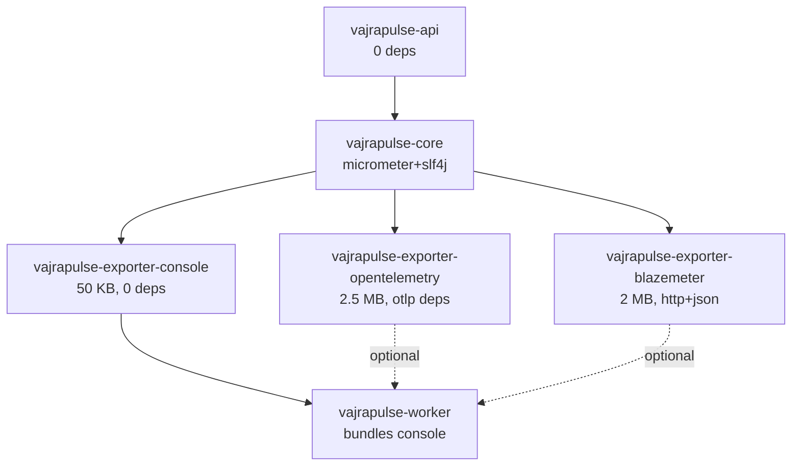

# VajraPulse Exporter Architecture - Quick Reference (Pre-1.0)

## 🚨 Pre-1.0: Breaking Changes Welcome!

**We haven't released 1.0 yet!** Priority order:
1. **Clean, simple code** (highest)
2. Correct architecture
3. Performance
4. ~~Backwards compatibility~~ (irrelevant pre-1.0)

**If it makes code cleaner: BREAK IT!**

---

## TL;DR: Cleanest Approach (Pure Separation)

**NO bundled exporters. Users add what they need.**

```
vajrapulse-core                 (interface only, ZERO implementations)
     ↓
     ├── vajrapulse-exporter-console        (~50 KB, user adds explicitly)
     ├── vajrapulse-exporter-opentelemetry  (~2.5 MB, optional)
     └── vajrapulse-exporter-blazemeter     (~2 MB, optional)
     ↓
vajrapulse-worker               (~700 KB, NO exporters bundled!)
```

**Breaking Change from Current:** Worker no longer includes console by default!
**Why It's OK:** Pre-1.0! Clean architecture > convenience.

---

## Key Design Decisions

### ✅ What's Already Good
1. `MetricsExporter` interface in core ✅
2. `PeriodicMetricsReporter` accepts any exporter ✅
3. `MetricsPipeline.Builder.addExporter()` supports multiple ✅

### 🔥 What We're Fixing (Pre-1.0 Freedom!)
1. **BREAK**: Remove duplicate `MetricsExporter.java` from console
2. **BREAK**: Remove console from worker deps (make fully pluggable)
3. **ADD**: OTLP exporter
4. **ADD**: BlazeMeter exporter
5. **NO DEPRECATED CODE**: Delete old patterns, don't preserve them!

---

## Clean Architecture (Pure Separation)

**One option only: The cleanest one!**

| Aspect | Pure Separation ✅ |
|--------|--------------------|
| **Modules** | 6 |
| **Worker JAR** | **~700 KB (NO exporters!)** |
| **Flexibility** | **Maximum** |
| **Coupling** | **Zero** |
| **Breaking changes** | **Acceptable (pre-1.0!)** |
| **Clean code** | **Yes!** |

**No compromises for backwards compatibility - we're pre-1.0!**

---

## Module Dependency Graph



---

## Implementation Phases (Pre-1.0: Move Fast!)

### Phase 0: Breaking Cleanup (1 hour) 🔥
- **BREAK**: Delete duplicate interface
- **BREAK**: Remove console from worker deps  
- **BREAK**: Update all examples to explicitly add console
- Fix tests, commit breaking changes

### Phase 1: OpenTelemetry Exporter (1 week)
- New module: `vajrapulse-exporter-opentelemetry`
- Dependencies: OTLP SDK (~2.5 MB)
- Features: HTTP/gRPC, authentication, batching
- No compatibility concerns!

### Phase 2: BlazeMeter Exporter (1 week)
- New module: `vajrapulse-exporter-blazemeter`
- Dependencies: OkHttp + Jackson (~2 MB)
- Features: API integration, session management
- Clean implementation from scratch

### Phase 3: SPI Discovery (2 days, optional)
- Auto-discover exporters via ServiceLoader
- Enable CLI: `--exporter opentelemetry`

**Total:** ~2-3 weeks for cleanest possible code!

### Phase 5: SPI Discovery (4 hours, optional)
- Auto-discover exporters via ServiceLoader
- Enable CLI: `--exporter opentelemetry`

---

## Example Usage Patterns (Clean Design)

### Pattern 1: Console (Explicit Choice)
```gradle
dependencies {
    implementation("com.vajrapulse:vajrapulse-worker:0.9.0")
    implementation("com.vajrapulse:vajrapulse-exporter-console:0.9.0")  // EXPLICIT!
}
```

```java
MetricsPipeline.builder()
    .addExporter(new ConsoleMetricsExporter())
    .build();
```

**Breaking Change:** Console no longer bundled!
**Why:** Cleaner separation, zero coupling.

### Pattern 2: OTLP Integration
```gradle
dependencies {
    implementation("com.vajrapulse:vajrapulse-worker:0.9.0")
    implementation("com.vajrapulse:vajrapulse-exporter-opentelemetry:0.9.0")
}
```

```java
MetricsPipeline.builder()
    .addExporter(new OpenTelemetryExporter(
        "http://localhost:4318/v1/metrics",
        "my-load-test"
    ))
    .withPeriodic(Duration.ofSeconds(10))
    .build();
```

### Pattern 3: Multi-Exporter
```java
MetricsPipeline.builder()
    .addExporter(new ConsoleMetricsExporter())      // Local
    .addExporter(new OpenTelemetryExporter(...))    // OTLP backend
    .addExporter(new BlazeMeterExporter(...))       // Cloud
    .withPeriodic(Duration.ofSeconds(5))
    .build();
```

All three exporters receive metrics simultaneously!

---

## JAR Size Breakdown

| Artifact | Size | Dependencies |
|----------|------|--------------|
| vajrapulse-core | ~600 KB | micrometer, slf4j |
| vajrapulse-exporter-console | **~50 KB** | **None** |
| vajrapulse-exporter-opentelemetry | ~2.5 MB | OTLP SDK |
| vajrapulse-exporter-blazemeter | ~2 MB | OkHttp, Jackson |
| **vajrapulse-worker (default)** | **~1.5 MB** | **console bundled** |
| vajrapulse-worker + OTLP | ~4 MB | add OTLP exporter |
| vajrapulse-worker + all | ~5.5 MB | add all exporters |

**Key insight:** Users pay only for what they use!

---

## Service Provider Interface (Optional)

### Why SPI?
- ✅ CLI can auto-discover exporters: `--exporter opentelemetry`
- ✅ No hardcoded exporter list in worker
- ✅ Third-party exporters work seamlessly

### How It Works

1. **Define provider interface in core:**
```java
public interface MetricsExporterProvider {
    String name();
    MetricsExporter create(Map<String, String> config);
}
```

2. **Each exporter implements it:**
```java
// In vajrapulse-exporter-opentelemetry
public class OtelExporterProvider implements MetricsExporterProvider {
    @Override public String name() { return "opentelemetry"; }
    
    @Override public MetricsExporter create(Map<String, String> config) {
        return new OpenTelemetryExporter(
            config.get("endpoint"),
            config.get("service.name")
        );
    }
}
```

3. **Register via META-INF/services:**
```
META-INF/services/com.vajrapulse.core.metrics.MetricsExporterProvider
→ com.vajrapulse.exporter.otel.OtelExporterProvider
```

4. **Auto-discover at runtime:**
```java
ServiceLoader<MetricsExporterProvider> loader = 
    ServiceLoader.load(MetricsExporterProvider.class);
    
for (MetricsExporterProvider provider : loader) {
    if (provider.name().equals("opentelemetry")) {
        return provider.create(config);
    }
}
```

---

## Performance Impact

### Export Latency Per Snapshot

| Exporter | Sync Latency | Async Latency | Network |
|----------|-------------|---------------|---------|
| Console | ~1 ms | N/A | No |
| OTLP | ~10 ms | ~2 ms | Yes |
| BlazeMeter | ~15 ms | ~3 ms | Yes |

**Recommendation:** Use async export for remote backends to avoid blocking test execution.

### Potential Optimization: Async Export

```java
public class AsyncMetricsExporter implements MetricsExporter {
    private final MetricsExporter delegate;
    private final ExecutorService executor;
    
    public AsyncMetricsExporter(MetricsExporter delegate) {
        this.delegate = delegate;
        this.executor = Executors.newSingleThreadExecutor();
    }
    
    @Override
    public void export(String title, AggregatedMetrics metrics) {
        executor.submit(() -> delegate.export(title, metrics));
    }
}
```

Usage:
```java
.addExporter(new AsyncMetricsExporter(
    new OpenTelemetryExporter(...)
))
```

---

## Migration Path (Zero Breaking Changes)

### Current Users (v1.0.0)
```java
// This continues to work exactly as-is
MetricsPipeline.builder()
    .addExporter(new ConsoleMetricsExporter())
    .build();
```

### New Users (v1.1.0) - Add OTLP
```gradle
// Just add dependency
implementation("com.vajrapulse:vajrapulse-exporter-opentelemetry:1.0.0")
```

```java
// Add to pipeline
.addExporter(new OpenTelemetryExporter(...))
```

**No code changes needed for existing users!**

---

## Custom Exporter Example

Anyone can create a custom exporter:

```java
public class InfluxDBExporter implements MetricsExporter {
    private final InfluxDBClient client;
    
    public InfluxDBExporter(String url, String token, String bucket) {
        this.client = InfluxDBClientFactory.create(url, token.toCharArray());
    }
    
    @Override
    public void export(String title, AggregatedMetrics metrics) {
        Point point = Point.measurement("load_test")
            .addTag("test", title)
            .addField("total", metrics.totalExecutions())
            .addField("success_rate", metrics.successRate())
            .addField("p95", metrics.successPercentiles().get(0.95))
            .time(Instant.now(), WritePrecision.NS);
            
        writeApi.writePoint(bucket, org, point);
    }
}
```

Use it:
```java
.addExporter(new InfluxDBExporter("http://localhost:8086", token, "metrics"))
```

---

## Questions to Decide

### 1. Should Console Stay in Worker?
- ✅ **Yes (recommended)**: Most users need console output
- ❌ **No**: Make it optional like others

**Decision:** Keep console bundled (Option C).

### 2. Service Provider Interface?
- ✅ **Yes**: Enables CLI auto-discovery, cleaner
- ❌ **No**: Simpler, users provide exporters explicitly

**Decision:** Add SPI in Phase 5 (optional, doesn't break anything).

### 3. Async Export by Default?
- ✅ **Yes**: Better performance for remote exporters
- ❌ **No**: Simpler, users can wrap if needed

**Decision:** Provide `AsyncMetricsExporter` wrapper, let users choose.

### 4. Version Lock Exporters with Core?
- ✅ **Yes**: Simpler compatibility
- ❌ **No**: Independent release cycles

**Decision:** Independent versions (exporter interface is stable).

---

## Next Steps

1. **Review this plan** with team
2. **Choose option** (recommend: Option C)
3. **Decide on SPI** (recommend: yes, Phase 5)
4. **Start Phase 1** (cleanup, 1 hour)
5. **Implement exporters** (Phases 2-3)
6. **Document** (examples, guides)

---

## References

- Full detailed plan: `EXPORTER_ARCHITECTURE_PLAN.md`
- Current code: `vajrapulse-core/metrics/MetricsExporter.java`
- Pipeline code: `vajrapulse-worker/pipeline/MetricsPipeline.java`
